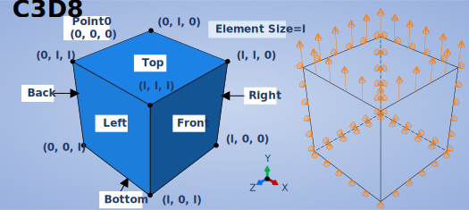

# One-Element INP Generator (Under Construction)
## *Turbocharge Modeling with Abaqus Python Script*

## Introduction

In the realm of material characterization and constitutive modeling, the one-element model plays a pivotal role, offering a swift yet comprehensive exploration of stress-strain responses in the development of new constitutive processes. Despite its fundamental importance, working with one-element models can be monotonous and repetitive.

This repository, built with Python, aims to alleviate the tedium by providing a versatile tool for generating common one-element models. The repository supports various generation methods and types, allowing for efficient debugging and exploration of the impact of model parameters on mechanical descriptions.

If you have any questions, please contact **Yutai Su** at [buaa_syt@126.com](mailto:buaa_syt@126.com).

## File Structure

- **`one_element_generator.py`**: The main Abaqus Python script file responsible for generating 3D models with a single element.
- **`README.md`**: Project documentation providing detailed information on the script and instructions for use.
- **`examples/`**: Directory containing sample files demonstrating different configurations and use cases.

## Configuration Parameters

### Generation Methods
1. **Abaqus Python Script**
   - Generates CAE and INP files using an Abaqus Python script.
2. **Python IDE**
   - Directly generates INP files using a Python Integrated Development Environment.

### Controllable Material Parameters (Updating)
1. **UMAT parameters**
2. **State Dependent Variables(SDVs)**
3. **Elastic parameters**
4. **Density**
5. **CTE**

### Controllable Geometric Parameters
1. **Mesh Size**
   - Adjust the size of the mesh for greater flexibility.

### Controllable Boundary Conditions
1. **Final Time Strain**
   - Control the strain at the final time step for precise simulations.

### Controllable Output Parameters
1. **Number of Output Points**
   - Fine-tune the level of detail in the output results.

### Element Types (Updating)
1. **C3D8**



2. **CPE4**
3. **CPS4**
4. **...**

## Usage

1. **Install Abaqus**: Ensure that Abaqus is installed on your system and that the environment variables are properly configured.

2. **Clone the Repository**:

    ```bash
    git clone https://github.com/your-username/3d-one-element-generator.git
    cd 3d-one-element-generator
    ```

3. **Run the Script**:

    ```bash
    abaqus cae noGUI=one_element_generator.py
    ```

    Replace `one_element_generator.py` with the actual script filename.

## Examples

Explore the `examples/` directory to see sample files showcasing how to configure the script for different types of single-element models. Each example includes corresponding documentation.

## Important Notes

- Before running the script, carefully read the `README.md` file to ensure all prerequisites are met.
- For any issues or suggestions, feel free to raise an issue on GitHub.

## License

This project is licensed under the [MIT License](LICENSE).

## Final Thoughts 🚀
  
The journey of exploring one element models is not just about simulations; it's a quest for understanding the intricacies of material behavior. As you navigate through this repository, may you find inspiration in the simplicity and power of one element models.

**Explore the diverse capabilities of this repository to streamline your one element model generation process.**

**Transform the mundane into the extraordinary with efficient, parameterized model generation.**

**Happy modeling!**
